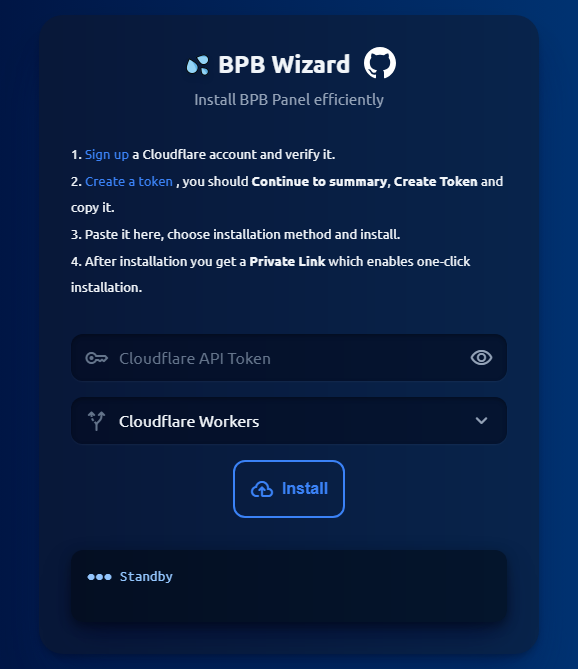
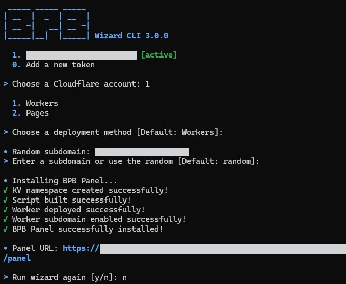

<h1 align="center">💦 Matix wizard</h1>

This project aims to facilitate the installation process of [BPB Panel](https://github.com/bia-pain-bache/BPB-Worker-Panel) efficiently and prevent user mistakes during deployments.
The wizard has now two editions: Web and CLI. The web edition generates a `Private Link` after deployment which enables `ONE-CLICK` installations per Cloudflare account. However Wizard CLI stores your logins on your operating system and supports multiple accounts' installations.

<p align="center" style="display:flex; align-items: flex-start; justify-content: center; gap: 20px;">
  
  
</p>

## Web edition

To install the latest stable version of BPB Panel:

```url
https://wizard.bpb-panel.workers.dev
```

<br>

## CLI edition

### Android (Termux) - Linux - macOS

Make sure to install Termux from [Github source](https://github.com/termux/termux-app/releases/latest) not Google Play.

```bash
bash <(curl -fsSL https://raw.githubusercontent.com/schooldars91-maker/Matixpanel/main/install.sh)
```

### Windows (PowerShell)

```bash
irm https://raw.githubusercontent.com/schooldars91-maker/Matixpanel/main/install.ps1 | iex
```

> [!TIP]
> Wizard CLI edition can only be used by these scripts. Standalone execution is not permitted.

## 🌟 Features

1. **Multi login**: You can manage several Cloudflare accounts using CLI edition. (Only first time token entry on each device).
2. **Methods**: Both Pages and Workers deployments are supported.
3. **Cross platform CLI**: Works on all major operating systems i.e. Windows, Android (Termux), macOS and Linux.
4. **ONE-CLICK installation**: Web edition creates a permanent `Private Link` to install BPB Panel on your account with one click in a few seconds.
5. **Privacy**: Web edition gets deployed directly from this repository and CLI edition is built using Github action. There's no storage and all open-source.
